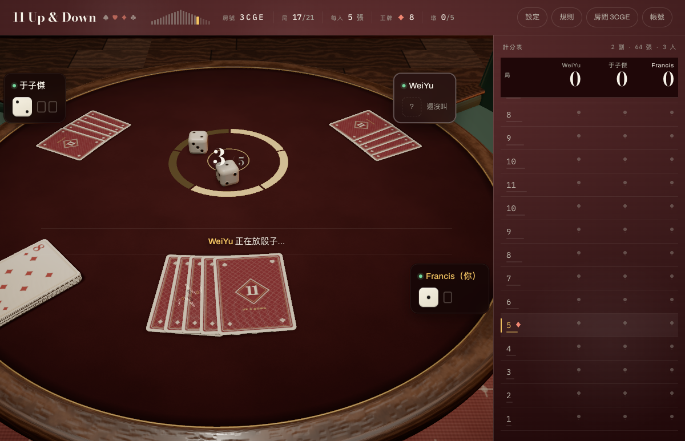
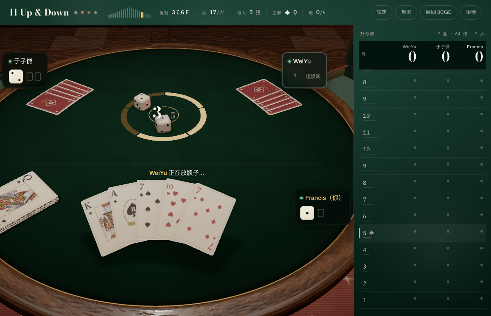

# 0003 — 線上多人「一輪結束卡著不動」「換局後手牌背面躺在桌上」「越玩越當」

日期：2026-09-22 · 對應 issue：[`agent/issues/0002-online-stall-and-facedown-hand.md`](../../issues/0002-online-stall-and-facedown-hand.md)

## 一眼看

| 改之前（無頭重現，跟 Francis 的截圖一樣） | 改之後 |
|---|---|
|  |  |

第 17 局叫墩中、輪 WeiYu 放骰子。左：我的五張牌背面朝上攤在面前的桌上（發牌的中繼站），
右：拿起來翻正扇開（該有的樣子）。同一支腳本 `dealslot.ts`，只差 `docs/index.html` 有沒有改。

## 三個結論

1. **手牌背面躺著＝接力補間倒序處理。** 我的牌是兩段接力（落桌 → 拿起翻正，`queue:true`）。
   `stepTweens()` 從陣列尾端往前走，一格拖太久讓兩段同時到期時，後段先到終點、前段再蓋回去。
   無頭 Chrome（swiftshader 一格好幾百毫秒）每次都中；改成由舊到新處理就對了。
2. **一輪結束不動＝只有一個人負責敲伺服器，他不在時全桌等他 30 秒。** 補救是其他在線的真人
   在這一格停得比該停的久 4 秒之後補敲一發（伺服器有樂觀鎖，多敲落空）。哪一台當時不在是推論，
   下次卡住請當事人開 `?trace=1` 看有沒有 `tick backup`。
3. **「越玩越當」不是漏記憶體。** 假伺服器照真實時序推完 21 局，立體／平面各一次，每局量一次
   （`soak.ts`，記錄在 `soak-3d.log`／`soak-2d.log`）：heap、補間、牌物件、場景子物件、WebGL 幾何／貼圖／程式、
   DOM 節點、`applyRow` 耗時全部不隨局數長。體感上的「越來越卡」最可能是 1、2 的機會隨局數累積，
   再加上一趟請求掛住時整條隊伍（含按下去的牌）都排在它後面——這一條加了逾時（token 6s、fetch 12s）。

## 數字（立體，節錄）

| 局 | heap MB | 補間 | 牌物件 | 場景子物件 | 幾何/貼圖/程式 | DOM | applyRow 平均 ms |
|---|---|---|---|---|---|---|---|
| 1 | 18.4 | 0 | 22 | 35 | 135/43/28 | 3034 | 3.27 |
| 6 | 16.8 | 7 | 41 | 52 | 135/44/43 | 3197 | 1.39 |
| 11 | 22.4 | 16 | 50 | 87 | 148/44/43 | 3279 | 1.20 |
| 16 | 18.8 | 10 | 35 | 46 | 135/44/43 | 3176 | 1.22 |
| 21 | 16.5 | 3 | 20 | 31 | 135/44/43 | 3056 | 1.25 |

第 11 局手牌最多（10 張），物件數跟著多，之後跟著降——是牌數，不是漏。

## 怎麼重跑

```
deno run -A agent/reports/0003-online-stall/dealslot.ts after      # 立體換局，9 秒後量五張牌的 flip/rx/z 並截圖
deno run -A agent/reports/0003-online-stall/soak.ts dim=3 rounds=21  # 21 局 soak（約 9 分鐘）；dim=2 平面
```

兩支都用同一資料夾的 `_browser.ts`（`scripts/_browser.ts` 的複本，多插一個接縫
`UD.__3d()` 露出 3D 的 `S` 與 `tweens`；`ROOT` 指向 repo 根目錄）。
`scripts/net_test.ts` 的十三（逾時）、十四（補敲）是這次加的回歸測試。
